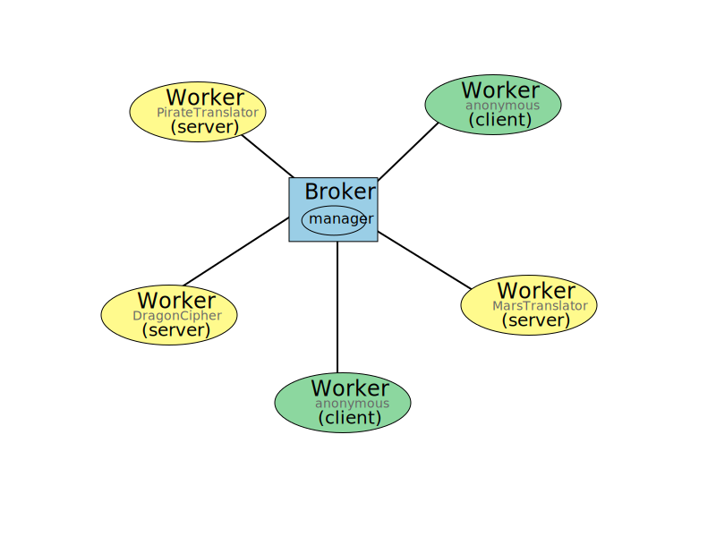

Usage
=============

Basic Concept
---------------------

The **InteractionFree** protocol involves two main roles, the *Broker* and the *Workers*.
A network consists one and only one *Broker*, and several *Workers*.
The *Broker* stands for a central coordinator that connects all the *Workers*, constructing a star-type network.
A *Worker* can have an unique name that can be addressed by other *Workers* (also called *Server*), or anonymous (also called *Client*).
Just like a normal server-client mode, the *Server* provides a service, and the *Client* consumes the service.
The only different is that the *Client* does not need to know the address of the *Server*, or access the *Server* directly.
They just need to know the *Broker* address and the unique name of the *Server*, and the *Broker* will take care of the rest.
A typical topological diagram is shown in the figure below.

Here, the yellow circle presents the named *Workder* (*Server*), and the green circles present the anonymous *Workers* (*Client*).

The major method of using this protocol is constructing an instance of ``IFWorker``, connecting to the *Broker*, and then making designed function calls on the ``IFWorker`` object.

.. code-block:: python

  worker.ServiceName.functionName(args)

``worker`` is the instance of ``IFWorker``.
``ServiceName`` is just like a menber of ``worker``, and ``functionName`` is just like a method of ``worker.ServiceName``. 

For example, if a *Server* named ``DragonCipher`` provides a function ``encrypt_to_dragon_speech``, the calling would be like this:

.. code-block:: python
  :linenos:

  worker.DragonCipher.encrypt_to_dragon_speech(humam_speech)

When any *Worker* makes the above invocation, it is actually the function in the *Server* ``DragonCipher`` that is executed.

There are also several functions provided by the ``IFBroker`` (actually by the ``Manager`` of the *Broker*).
Calling these functions is similar to calling the functions of a *Worker*, except that the ``ServiceName`` is emitted, as following,

.. code-block:: python

  worker.functionName(args)

The functions available in the *Broker* are listed in the API documentation :class:`~interactionfreepy.broker.Manager`.
Plase note that, when invoding function of ``Manager`` through the protocol, the parameter ``sourcePoint`` will be automatically passed, that you do not need to pass it manually.
The ``Manager`` can also be customized by the user.
See more detailed information in :ref:`costomize-manager`.

Install
---------------------

To install the package, you can use pip.

.. code-block:: shell

  pip install interactionfreepy

Host a Broker
---------------------

It is simple to host a *Broker*.
One may start with the :class:`~interactionfreepy.broker.IFBroker` class.

.. code-block:: python
  :linenos:

  from interactionfreepy import IFBroker, IFLoop

  broker = IFBroker()
  IFLoop.join()

Here, ``IFBroker()`` creates the *Broker* instance and listening on the default port ``1061``.
You can also change the port by explicitly passing the port number to the constructor, for example, ``8061``.

.. code-block:: python
  :linenos:

  from interactionfreepy import IFBroker, IFLoop

  broker = IFBroker('*:8061')
  IFLoop.join()

The address can also be specified (by replacing ``*`` with the IP address of the machine) to allow only local connections.
The ``IFLoop.join()`` is a blocking call that will keep the program running until terminated.

You can also host the *Broker* in a docker container.
The docker image is available at `hwaipy/ifbroker <https://hub.docker.com/r/hwaipy/ifbroker>`_.
To run the broker in a docker container, you can use the following command:

.. code-block:: shell

  docker run -d -p 1061:1061 --name IFBroker hwaipy/ifbroker:latest

Connect to a Broker
-------------------------

Use the :class:`~interactionfreepy.worker.IFWorker` class to connect to a *Broker*.
For the purpose of givign an example, we will use the public *Broker* hosted by ``interactionfree.cn:1061``.
You could change the address to your own *Broker* if you have already hosted one.

.. code-block:: python
  :linenos:

  from interactionfreepy import IFWorker

  worker = IFWorker('interactionfree.cn:1061')

After connected to the *Broker*, you can check the protocol version to ensure the connectivity.

.. code-block:: python
  :linenos:

  print(worker.protocol())

The output should be ``b'IF1'`` by default.

Registrate a Service
-------------------------

After connected to the *Broker*, you can register the *Worker* as a *Server* by invoking :meth:`~interactionfreepy.worker.IFWorker.bindService`.
We can still use the dragong cipher as an example.
If you have a class named ``DragonCipher`` that provides a function ``encrypt_to_dragon_speech``, as defined below, 

.. code-block:: python
  :linenos:

  class DragonCipher:
    def encrypt_to_dragon_speech(self, text: str) -> str:
      result = []
      for char in text:
        lower_char = char.lower()
        if lower_char in {'a', 'e', 'i', 'o', 'u'}:
          new_char = '*'
        elif char.isalpha():
          new_char = f"{char}-ar" if char.isupper() else f"{char}-ar"
        else:
          new_char = char
        result.append(new_char)
      return ''.join(result)

You can simply publish it as a service by calling the ``bindService`` method of the ``IFWorker`` instance.

.. code-block:: python
  :linenos:
  
  dragon_cipher = DragonCipher()
  worker.registerAsService('DragonCipher', dragon_cipher)

You can even combine the creation of ``IFWorker`` instance and binding the service together, as follows,

.. code-block:: python
  :linenos:

  worker = IFWorker('tcp://interactionfree.cn:1061', 'DragonCipher_Aelice', DragonCipher())

  

Invoking a remote Service
-----------------------------

An ``IFWorker``, whether named or anonymous, can invoke a remote service by calling the function directly.
For example, if you have a *Server* named ``DragonCipher`` that provides a function ``encrypt_to_dragon_speech``, you can call it from a completely machine by:

.. code-block:: python
  :linenos:

  from interactionfreepy import IFWorker
  
  worker = IFWorker('interactionfree.cn:1061')
  
  humam_speech = 'To be or not to be'
  dragon_speech = worker.DragonCipher_Alice.encrypt_to_dragon_speech(humam_speech)
  print(f'{humam_speech} -> {dragon_speech}')

The parameters can be numbers, strings, lists, or maps.
See :ref:`spec` for a full list of available types.

.. _costomize-manager:

Customizing the Manager
-------------------------

manager